# Characterizing complex networks using fisher vector applied in shape analysis

> Rozeno, Vitor Emanuel da Silva. "Caracterização de redes complexas utilizando Fisher Vector para análise de contornos." (2024).

Study conducted with the aim of extracting machine learning features from shape contours mapped as complex networks using the Fisher Vector method.

More theoretical information available [here](https://repositorio.unesp.br/entities/publication/174b6544-a5a1-448b-b97f-217f27fa2392).

# Results

## Parameter analysis:

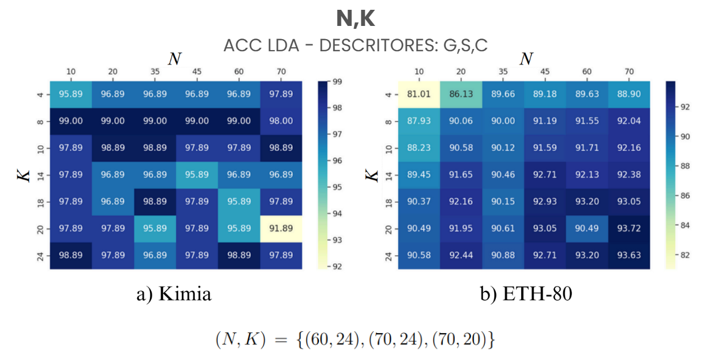
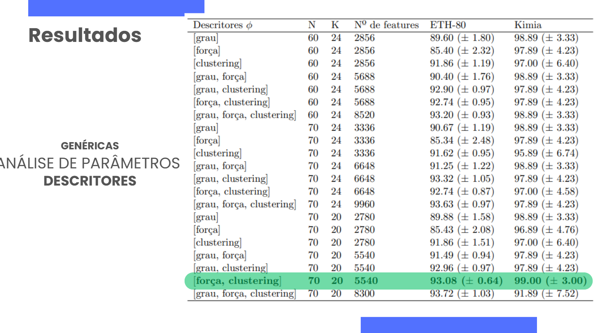
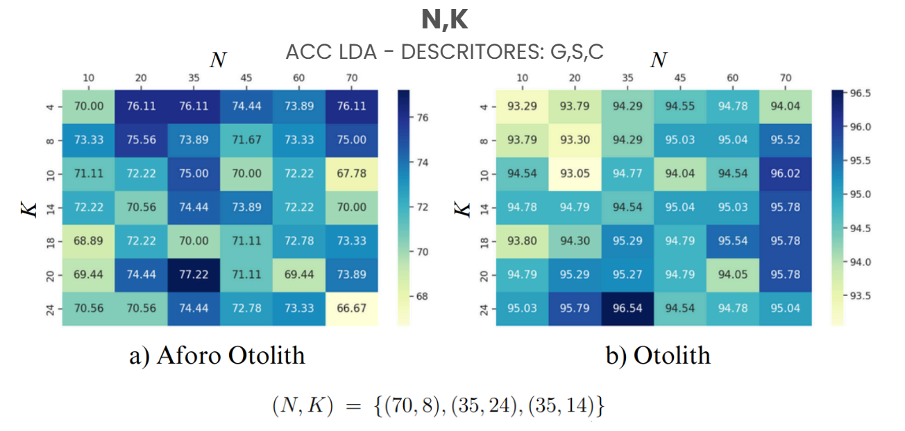
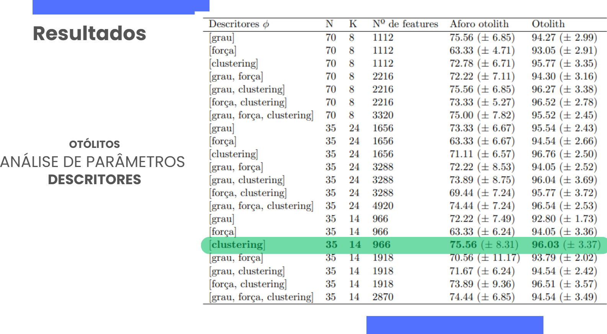
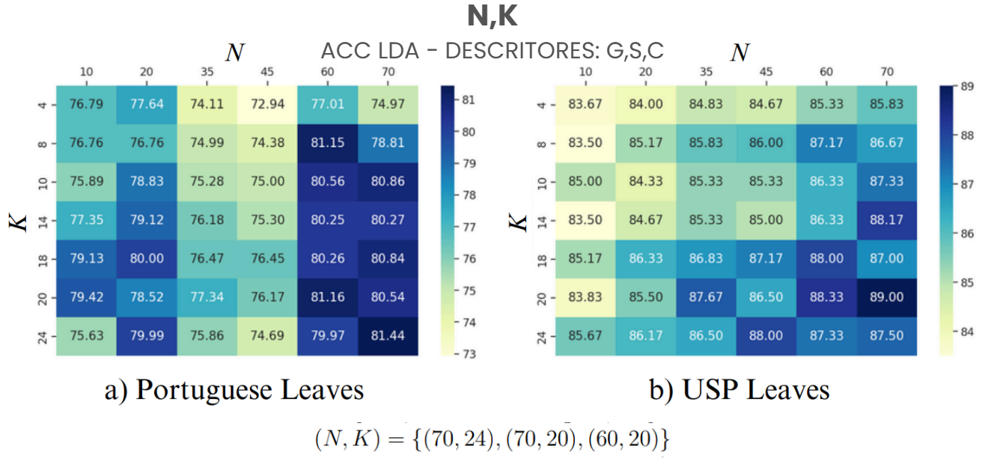
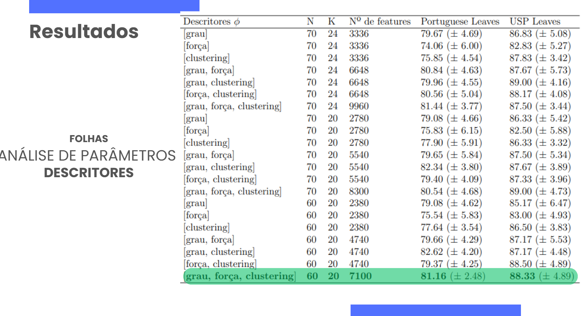

## Methods Comparison

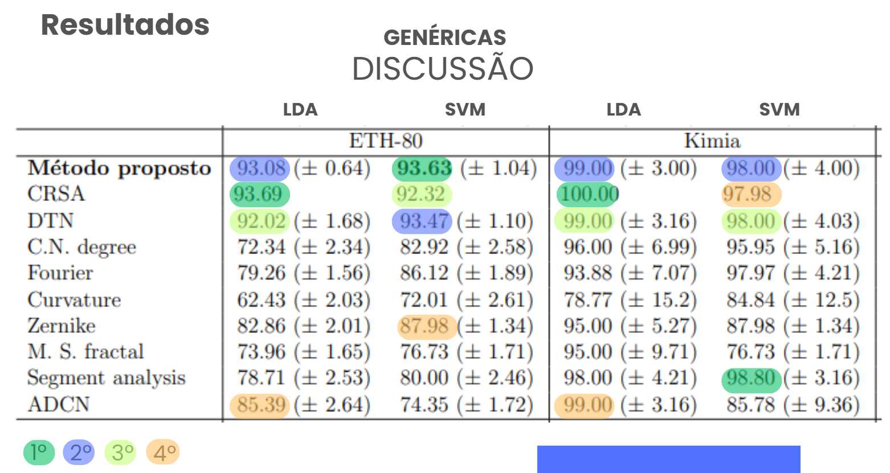
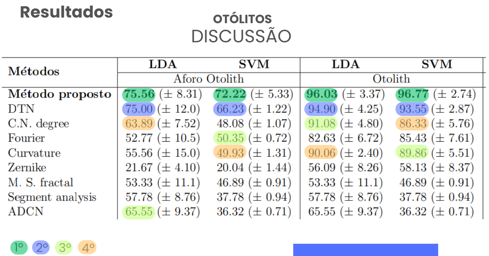
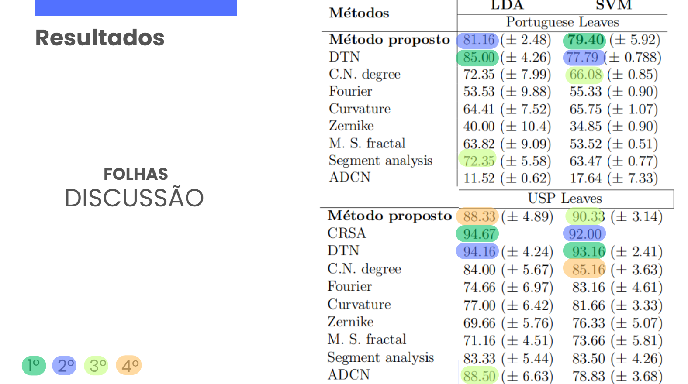
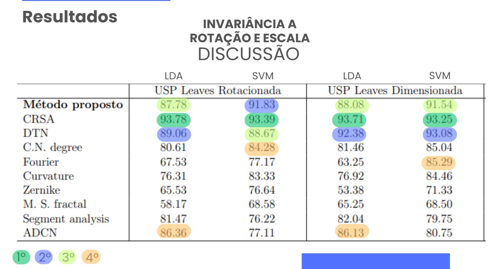
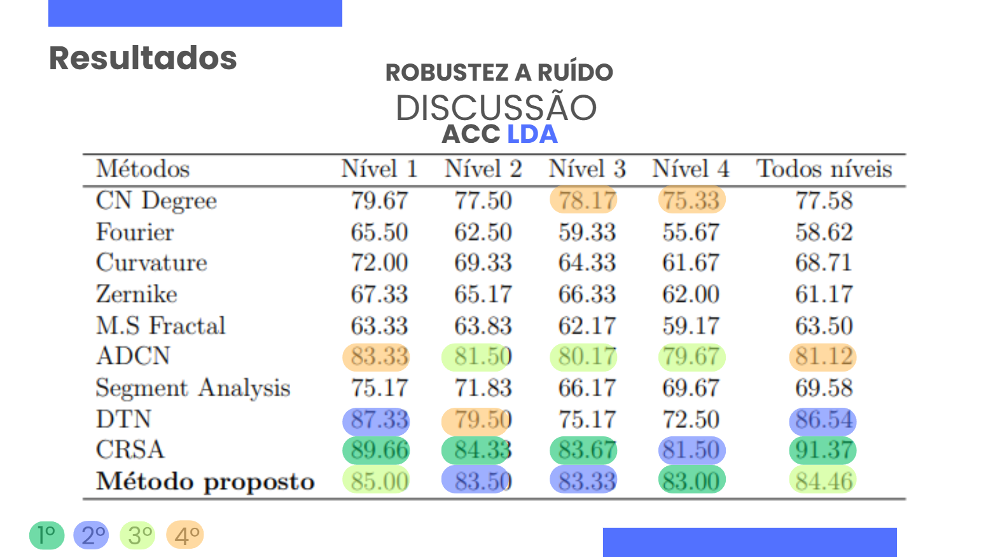
